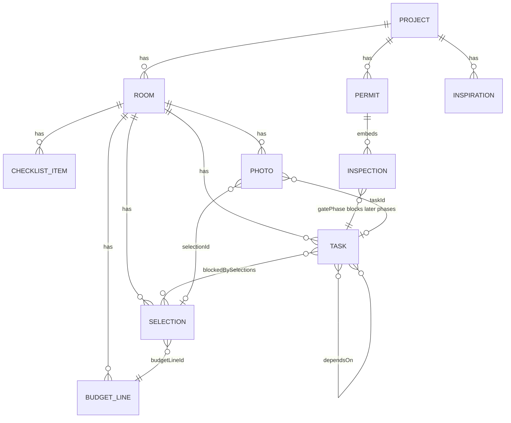

# Remodel Planner

A single-user, single-household web app for planning a room-by-room home
remodel: an SVG floorplan you draw, per-room checklists and budgets, a
phase-sequenced task board with dependency/selection/inspection gating, a
lead-time selections tracker, Cobb County permits with gating inspections,
before/during/after photos, and a researched design-inspiration gallery — all
backed by Firebase and grounded in applied design-psychology research.

> Built room-first: the **floorplan is the home screen**, and clicking a room on
> the plan is the canonical way into its detail (recognition over recall).

## Stack

| Layer | Choice |
|---|---|
| Framework | Nuxt 4 (SPA, `ssr: false`), Vue 3, TypeScript strict |
| UI | Vuetify 4 (MD3), `@mdi/font`, light/dark theme |
| PWA | `@vite-pwa/nuxt` (installable, offline shell) |
| State | Pinia (`@pinia/nuxt`) |
| Backend | Firebase — Firestore, Storage, Auth (Google), Hosting, App Check |
| Firestore binding | VueFire (`nuxt-vuefire`), offline persistence (multi-tab) |
| Validation | Zod 4 (schemas + `withConverter` Firestore converters) |
| Research render | build-time `markdown-it` → `virtual:research-content` (no `@nuxt/content`) |
| Tests | Vitest (unit/money/rollups/gates), Playwright (smoke) |

Money is **integer cents** end to end; dollars exist only at the render
boundary (`app/utils/money.ts`). Dates a human picks are date-only
`YYYY-MM-DD` strings; event timestamps are Firestore `Timestamp`s.

## Projects & environments

Two GCP/Firebase projects, region **`us-east1`**:

| Alias | Project ID | Used by |
|---|---|---|
| `dev` | `remodel-planner-dev` | all development (`pnpm dev`) |
| `prod` | `remodel-planner-prod` | deploy only (Phase 13) |

`.firebaserc` maps the aliases. **Every** Firebase CLI command passes
`--project dev` or `--project prod` explicitly — never the active alias. Seed
and test scripts hard-fail if pointed at prod.

### Env file layout

Web config is injected via `runtimeConfig` from `.env.<mode>` (all `.env*` are
gitignored except `.env.example`):

- `.env.development` — the **dev** project's web config; `pnpm dev` loads it via
  `nuxt dev --dotenv .env.development`. There is no code path by which a dev
  session writes to prod.
- `.env.production` — the **prod** project's web config; `nuxt generate` in
  production mode loads it.
- `.env.example` — the committed template (keys, no secrets).

Required keys (see `.env.example`): `NUXT_PUBLIC_FIREBASE_*` (apiKey,
authDomain, projectId, storageBucket, messagingSenderId, appId) and the
optional `NUXT_PUBLIC_RECAPTCHA_ENTERPRISE_KEY` + dev
`FIREBASE_APPCHECK_DEBUG_TOKEN` (never committed). **No service-account keys are
ever committed.**

## Develop

```bash
pnpm install
pnpm dev          # nuxt dev --dotenv .env.development → http://localhost:3000
pnpm typecheck    # nuxt typecheck (strict)
pnpm lint         # eslint flat config
pnpm test         # vitest run
pnpm build        # nuxt build (Nitro)  — sanity
pnpm generate     # static SPA → .output/public (what Hosting serves)
pnpm analyze      # bundle visualizer
```

Google sign-in is the one un-automatable setup step: enable the Google provider
once in the dev project's Auth console (it auto-creates the OAuth client). The
app's sign-in (`app/pages/signin.vue`, `signInWithPopup`) is already wired; a
COOP `same-origin-allow-popups` header (`firebase.json`) keeps the popup flow
working.

## Data model

Everything is scoped under the authenticated user. Project-wide dashboards and
rollups use **collection-group queries** authorized by a denormalized `uid` +
`projectId` on every document.

```
users/{uid}/projects/{projectId}
  ├─ rooms/{roomId}
  │    ├─ checklist/{itemId}
  │    ├─ budgetLines/{lineId}
  │    ├─ tasks/{taskId}
  │    ├─ selections/{selectionId}
  │    └─ photos/{photoId}
  ├─ permits/{permitId}            (inspections embedded)
  └─ inspiration/{itemId}
users/{uid}/sharedProjects/{projectId}   (shared-project pointers)
invites/{token}                          (top-level invite tokens)
```



`TaskPhase` enforces real remodel sequencing:
`demo → rough-in → insulation → drywall → paint → flooring → trim → fixtures → punch-list`.
A task can't start while a `dependsOn` predecessor is unfinished, a
`blockedBySelections` selection is undelivered, or an inspection gating an
earlier phase is unpassed (override with confirm).

Single source of truth: all progress math (`app/utils/rollup.ts` via
`useRollup`) and all money math (`budget-math.ts`, `useBudget`) come from one
place, so the floorplan rings, app-bar ring, and dashboards cannot disagree.

## Security rules

- **Firestore** (`firestore.rules`): every document is readable/writable by its
  owner (`request.auth.uid == uid`). Writes additionally validate the
  denormalized `uid` and enum/required fields at the database boundary.
  Collection-group reads (tasks, checklist, selections, budgetLines, photos) are
  authorized by `resource.data.uid`. Project membership (an accepted-invite
  editor) extends read/write via `isMember(ownerUid, projectId)`; members cannot
  modify the project doc or add other members.
- **Storage** (`storage.rules`): owner-only, content-type `image/*`, 10 MB max,
  scoped to `users/{uid}/…`.
- Rules are versioned in-repo and deployed alongside indexes
  (`firestore.indexes.json`).

> **Scope note:** v1 was specified single-user. A multi-user **project sharing /
> invite** feature and **L-shaped room notches** were added at the owner's
> explicit request, deviating from the original non-goals; both are documented in
> `.remodel/registry.json` → `decisions`.

## Export / import & backups

- **Portability:** full-project JSON export/import (client-side, walks every
  subcollection) lives in `app/utils/project-io.ts`. The export carries a
  `schemaVersion`; import refuses newer versions and migrates older ones, then
  re-validates every doc through Zod.
- **Real backups:** `scripts/setup-backups.sh` provisions a GCS bucket + a
  weekly scheduled `gcloud firestore export` via Cloud Scheduler on the **prod**
  project (run during deploy; verify the first export manually).
- **Photo cleanup:** a client sweep on app start hard-deletes photo
  soft-deletes older than 24h (no Cloud Functions own the cleanup).

## Deploy (prod)

See **[`DEPLOY.md`](./DEPLOY.md)** for the full runbook. Prod deploy is blocked
on owner GCP setup (prod is unbilled with no infra, and `.env.production` still
holds dev placeholder config); the repo-side config (`.firebaserc`,
`firebase.json`, rules, indexes, `scripts/setup-backups.sh`) is complete and
`pnpm generate` produces the deployable static SPA.

```bash
# after the DEPLOY.md prerequisites (billing, APIs, prod web config) are done:
NODE_ENV=production pnpm generate
firebase deploy --only hosting,firestore:rules,firestore:indexes,storage --project prod
scripts/setup-backups.sh remodel-planner-prod us-east1
```

App Check (reCAPTCHA Enterprise) runs with a debug token in dev; enforcement on
prod Firestore/Storage is switched on during deploy after verifying the deployed
app works end to end.

## Project state

Build phases and their completion criteria are tracked in
`.remodel/registry.json` (the source of truth, updated per phase). Phases 1–11
(research → inspiration) are complete; verify and deploy are the final steps.
